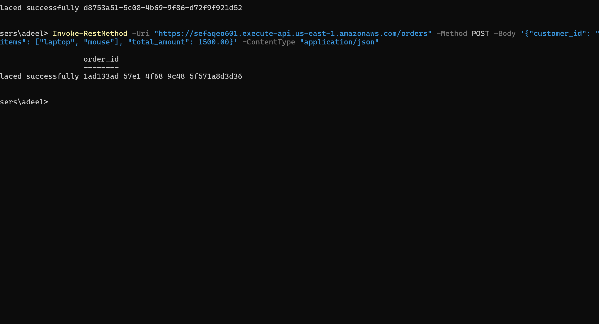
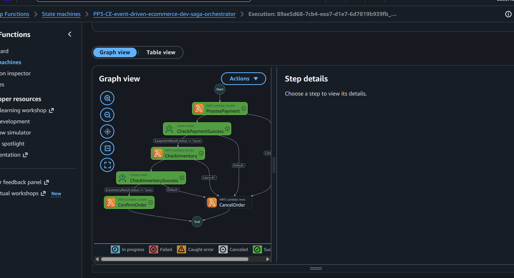
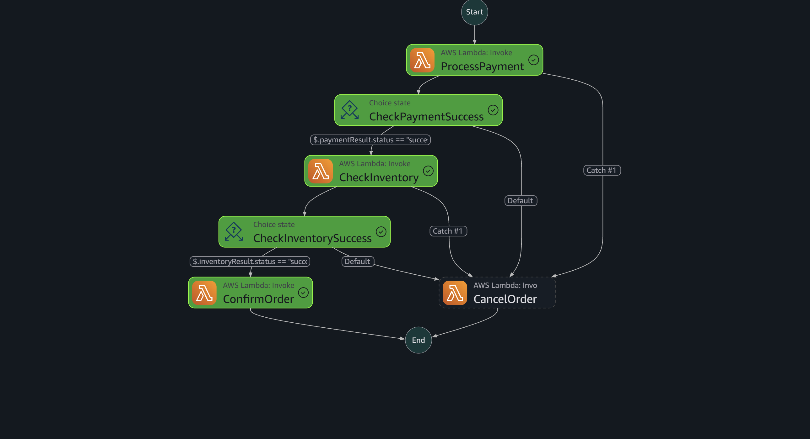
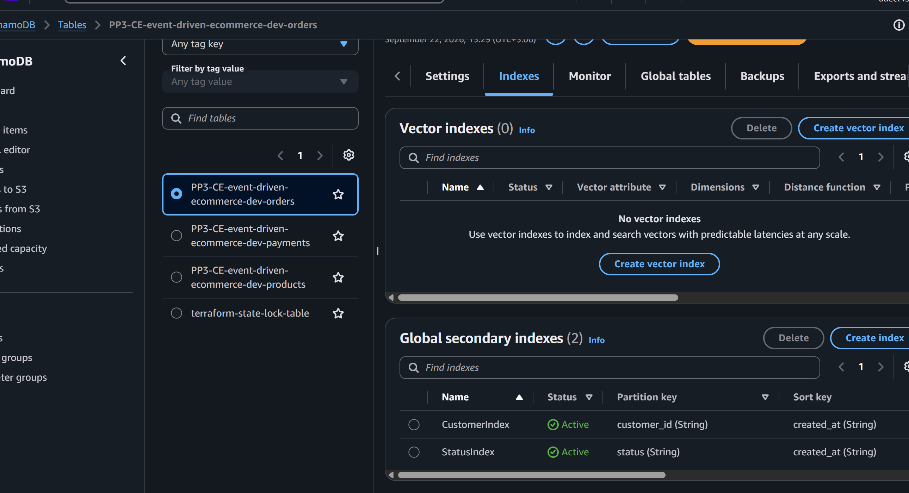
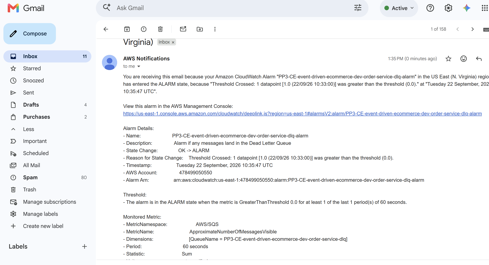

# Event-Driven E-Commerce Architecture Guide

This repository contains the infrastructure and application code for a fully serverless, event-driven e-commerce platform built on Amazon Web Services. The objective of this project is to demonstrate highly scalable microservice choreography and orchestration without managing any underlying servers.

By leveraging native cloud services, this architecture ensures high availability, fault tolerance, and independent scalability for each business domain.

## Visual Overview

The following grid showcases the system architecture, state machine execution flows, and integration diagrams.

<table>
  <tr>
    <td width="50%"></td>
    <td width="50%"></td>
  </tr>
  <tr>
    <td width="50%"></td>
    <td width="50%"></td>
  </tr>
  <tr>
    <td colspan="2" align="center"></td>
  </tr>
</table>

## Core Architectural Concepts

The system is separated into distinct microservices representing different business capabilities: Order Management, Payment Processing, Inventory Management, and Customer Notifications. 

### API Gateway and Compute
All external traffic is handled by Amazon API Gateway, which acts as the front door to the backend services. The API Gateway routes incoming HTTP requests to the appropriate AWS Lambda functions. Lambda provides the serverless compute layer, scaling automatically to meet concurrent demand while billing only for actual execution time.

### Database Layer
State and transactional data are stored in Amazon DynamoDB. We use single-table design principles where appropriate, providing single-digit millisecond latency at any scale. Each microservice maintains strict data isolation, ensuring that the Payment Service cannot directly mutate the Inventory Service database.

### Event Choreography
Domain events are routed through Amazon EventBridge. When a new order is placed, an "OrderCreated" event is published to a central event bus. Other microservices subscribe to this bus, allowing them to react asynchronously. This pattern heavily decouples the architecture.

### Orchestration and SAGA Pattern
For distributed transactions that require strict sequencing and rollback capabilities, AWS Step Functions coordinates the workflow. If a payment is successful but inventory reservation fails, the Step Functions state machine automatically executes compensating transactions to refund the payment and cancel the order.

### Monitoring and Observability
System health is tracked using Amazon CloudWatch and Amazon SNS. All Lambda executions output logs and metrics. If a message fails processing multiple times, it is routed to a Dead Letter Queue. CloudWatch Alarms actively monitor these queues and trigger SNS topics to page the engineering team immediately upon failure.

## Infrastructure as Code

The entire environment is provisioned using Terraform. 

* The `environments/dev` directory contains the entry point for the development stage.
* The `modules` directory contains reusable Terraform components for the API Gateway, DynamoDB tables, EventBridge, Lambda functions, and Step Functions.

## Deployment Steps

1. Configure your AWS Command Line Interface with appropriate credentials.
2. Ensure you have Python installed to package the microservices.
3. Package each microservice directory into a deployment artifact (ZIP file).
4. Navigate to the Terraform development environment directory.
5. Execute the terraform initialization command to download required providers.
6. Apply the Terraform configuration to provision the AWS resources.

Once the infrastructure is successfully deployed, Terraform will output the public API endpoint URL. You can use standard HTTP clients to send POST requests and trigger the entire event-driven flow.

## Cleanup Instructions

To maintain a zero-cost footprint after testing, ensure you destroy all provisioned resources. Run the terraform destroy command in the environment directory to safely remove the API Gateway, Lambda functions, databases, and event buses.
