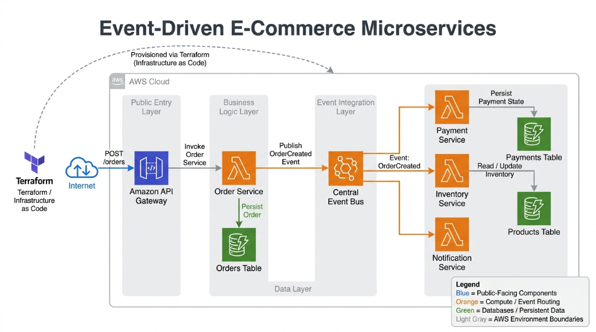
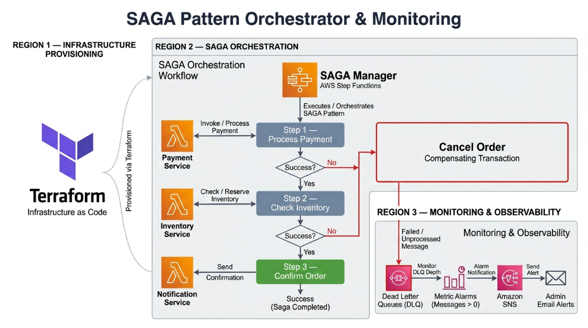

# Serverless Event-Driven E-Commerce Architecture

This repository contains the infrastructure and application code for a scalable, serverless e-commerce backend built entirely on Amazon Web Services. The project demonstrates advanced cloud engineering patterns, specifically event choreography for loose coupling and SAGA pattern orchestration for distributed transactions.

The architecture ensures high availability, strict fault tolerance, and independent scalability for distinct business domains.

## System Architecture

<table>
  <tr>
    <td width="50%"></td>
    <td width="50%"></td>
  </tr>
</table>

## Core Engineering Concepts

### Decoupled Microservices
All business logic is segmented into isolated domains: Order Management, Payment Processing, Inventory Management, and Customer Notifications. Each service is powered by AWS Lambda, allowing compute resources to scale automatically in response to traffic spikes without the need to provision or manage servers.

### Event Choreography
To prevent tight coupling between services, state changes trigger domain events. When a customer places an order, the Order Service publishes an event to Amazon EventBridge. Downstream services subscribe to this central bus and react asynchronously. This pattern prevents cascading failures and allows new services to be added without modifying existing code.

### SAGA Orchestration and Distributed Transactions
Microservices introduce the challenge of maintaining data consistency across multiple databases. This architecture implements the SAGA pattern using AWS Step Functions. If a transaction succeeds partially (for example, a payment succeeds but inventory reservation fails), the state machine automatically executes compensating transactions to refund the customer and cancel the order gracefully.

### Single-Table Data Persistence
State is managed using Amazon DynamoDB. Each microservice interacts strictly with its own isolated table to prevent data entanglements and ensure single-digit millisecond latency at scale.

### Observability and Resilience
System health is continuously monitored via Amazon CloudWatch. To handle transient failures, the system implements automated retries. If a message repeatedly fails to process, it is routed to an Amazon SQS Dead Letter Queue. CloudWatch Metric Alarms actively monitor these queues and trigger Amazon SNS topics to notify engineers of unhandled exceptions.

## Infrastructure as Code

The entire environment is codified using Terraform, ensuring the infrastructure is reproducible, version-controlled, and self-documenting. Reusable Terraform modules are created for API Gateway, EventBridge, Lambda functions, DynamoDB, and Step Functions to maintain a clean and modular codebase.

## Deployment Guide

Ensure you have the AWS CLI configured with administrative access, Terraform installed, and Python 3.12 available.

1. Package the Python microservices:
```bash
Compress-Archive -Path services\order-service\* -DestinationPath services\order-service\order-service.zip -Force
Compress-Archive -Path services\payment-service\* -DestinationPath services\payment-service\payment-service.zip -Force
Compress-Archive -Path services\inventory-service\* -DestinationPath services\inventory-service\inventory-service.zip -Force
Compress-Archive -Path services\notification-service\* -DestinationPath services\notification-service\notification-service.zip -Force
```

2. Initialize and deploy the infrastructure:
```bash
cd terraform/environments/dev
terraform init
terraform apply
```

3. Test the deployment using the API Gateway URL provided in the Terraform output:
```bash
Invoke-RestMethod -Uri "YOUR_API_URL" -Method POST -Body '{"customer_id": "cust_123", "items": ["laptop", "mouse"], "total_amount": 1500.00}' -ContentType "application/json"
```

To prevent unnecessary AWS charges, destroy the infrastructure when testing is complete by running `terraform destroy` in the development environment directory.

## Implementation Screenshots

<table>
  <tr>
    <td width="50%"></td>
    <td width="50%"></td>
  </tr>
  <tr>
    <td width="50%"></td>
    <td width="50%"></td>
  </tr>
  <tr>
    <td colspan="2" align="center"></td>
  </tr>
</table>
