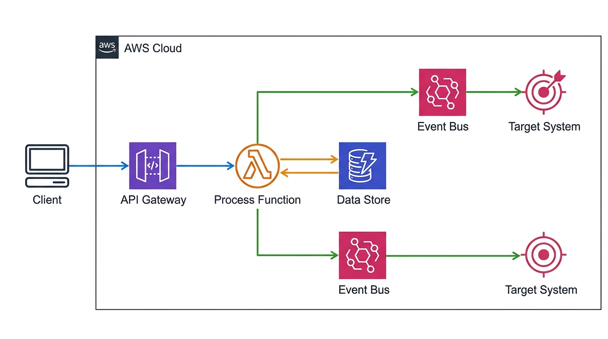
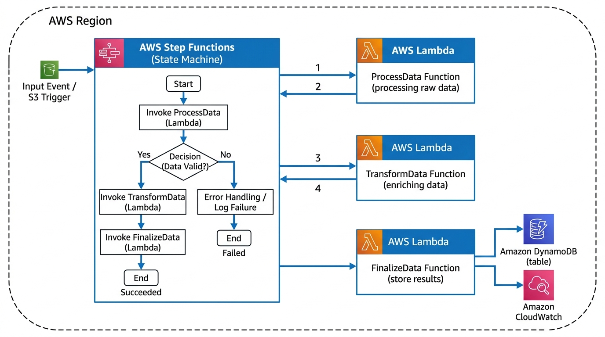

# Event-Driven E-Commerce Backend

This project implements a fully serverless backend for an e-commerce platform on AWS. It uses an event-driven architecture to decouple microservices, allowing them to scale independently based on demand. The infrastructure is defined entirely as code using Terraform and relies on native AWS services to handle API routing, computation, NoSQL storage, and orchestration.

## Architecture





## Key Features

* Serverless compute using AWS Lambda to process orders, payments, inventory, and notifications.
* Event choreography using Amazon EventBridge to route domain events between isolated microservices.
* SAGA pattern orchestration using AWS Step Functions to manage distributed transactions and handle graceful rollbacks if a service fails.
* Managed NoSQL storage using Amazon DynamoDB with single-table design principles.
* Infrastructure as code built with Terraform, using modular components for reuse and clean state management.
* Automated monitoring using CloudWatch Dashboards and SNS alerts for Dead Letter Queue failures.

## File Structure

```text
.
|-- assets/
|   |-- architecture_1.jpg
|   |-- architecture_2.jpg
|-- services/
|   |-- inventory-service/
|   |-- notification-service/
|   |-- order-service/
|   |-- payment-service/
|-- terraform/
|   |-- environments/
|   |   |-- dev/
|   |-- modules/
|   |   |-- api-gateway/
|   |   |-- dynamodb/
|   |   |-- eventbridge/
|   |   |-- lambda-service/
|   |   |-- monitoring/
|   |   |-- sqs-dlq/
|   |   |-- step-functions/
```

## Prerequisites

* AWS CLI installed and configured with administrator credentials.
* Terraform installed locally (version 1.5.0 or newer).
* Python 3.12 installed for packaging Lambda functions.

## Deployment

1. Package the Python microservices into ZIP files before deploying.
```bash
Compress-Archive -Path services\order-service\* -DestinationPath services\order-service\order-service.zip -Force
Compress-Archive -Path services\payment-service\* -DestinationPath services\payment-service\payment-service.zip -Force
Compress-Archive -Path services\inventory-service\* -DestinationPath services\inventory-service\inventory-service.zip -Force
Compress-Archive -Path services\notification-service\* -DestinationPath services\notification-service\notification-service.zip -Force
```

2. Initialize Terraform in the development environment.
```bash
cd terraform/environments/dev
terraform init
```

3. Review the execution plan and apply the infrastructure.
```bash
terraform apply
```

4. Once applied, Terraform will output the public API URL. You can test the system by sending a POST request to this endpoint.
```bash
Invoke-RestMethod -Uri "YOUR_API_URL" -Method POST -Body '{"customer_id": "cust_123", "items": ["laptop", "mouse"], "total_amount": 1500.00}' -ContentType "application/json"
```

## Cleanup

To avoid incurring any unexpected charges, destroy the infrastructure when you are done testing.
```bash
cd terraform/environments/dev
terraform destroy
```
